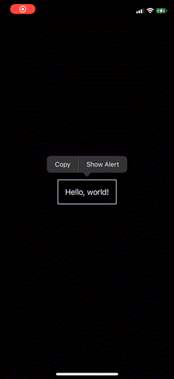

# EditMenu

A SwiftUI extension to allow creating custom "Edit Menus" (`UIMenuController`) 

# Example Usage



```swift
import SwiftUI
import EditMenu

struct ContentView: View {
    @State var showAlert = false
    
    var body: some View {
        HStack {
            Text("Hello, world!")
                .padding()
                .border(Color.white)
                .editMenu {
                    EditMenuItem("Copy") {
                        print("copy")
                    }
                    EditMenuItem("Show Alert") {
                        showAlert = true
                    }
                }
        }.alert(isPresented: $showAlert) {
            Alert(title: Text("This is an alert"))
        }
    }
}
```